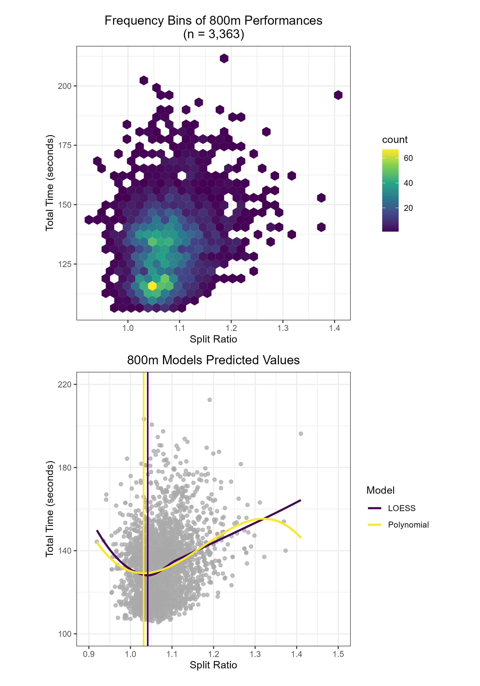
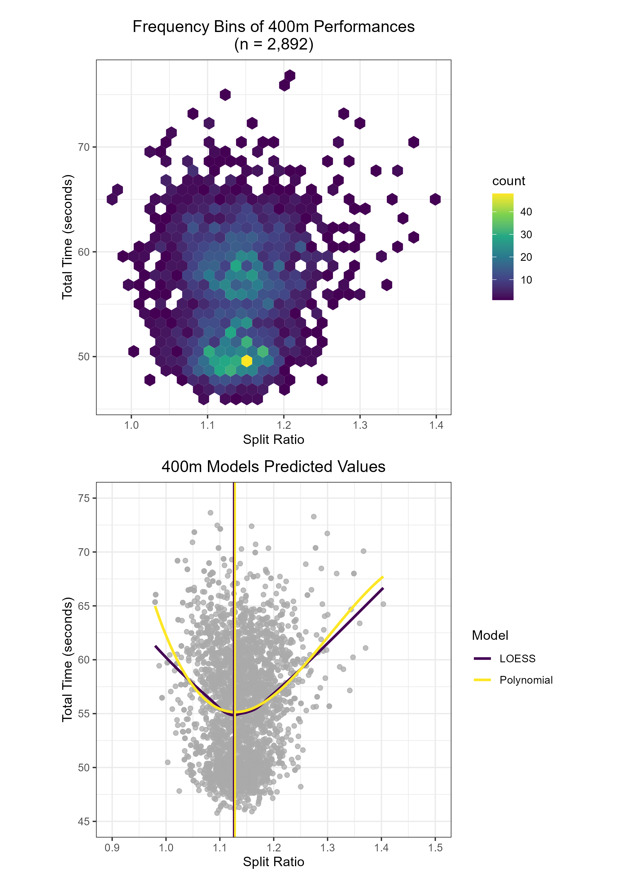

***

```{=html}
<style type="text/css">
h1.title {
  font-size: 30px;
  text-align: center;
  font-weight: bold;
}
.author, .date {
  font-size: 20px;
  text-align: center;
}
div#TOC {
    padding-left: 25%;
    padding-right: 25%;
    font-weight: bold;
}
h3 {
    font-weight: bold;
}
.table td:first-child {
    vertical-align: middle;
}
hr {
    border: 1px solid black; 
    background-color:black;
}
</style>
```

```{r setup, include=FALSE}
knitr::opts_chunk$set(echo = FALSE,
                      fig.align = 'center',
                      warning = FALSE,
                      error = FALSE,
                      message = FALSE)

library(RSQLite)
library(tidyverse)
library(segmented)
library(patchwork)
library(glue)  # Replicate Python f strings
library(rlang)  # Custom tidyverse function / custom ggplot function

rm(list = ls())
```

```{r import-data, include=FALSE}
driver = dbDriver('SQLite')
db_path = Sys.getenv('DB_PATH')

db = dbConnect(drv = driver,
               dbname = db_path)

d800 = dbReadTable(db, 'splits_800m')
d400 = dbReadTable(db, 'splits_400m')
```

```{r EDA, include=FALSE}
# Turn off include=FALSE if you want to run this EDA cell

plot_density <- function(data, var, title) {
    ggplot(data, aes( x = {{var}})) + 
        geom_density(size = 1) + 
        theme_bw() + 
        theme(aspect.ratio = 1 / 1.618, plot.title = element_text(hjust = 0.5)) + 
        ggtitle(title)
}

analyze_data <- function(data, event){
    # Plot the density of total time and split ratios
    plot_density(data, total_time_sec, glue('Total Time Density {event}')) %>% print()
    plot_density(data, split_ratio, glue('Split Ratio Density {event}')) %>% print()
    
    # Extract density information
    ratio_plot = plot_density(data = data, var = split_ratio, NULL)
    ratio_plot_density = ggplot_build(ratio_plot)
    
    # Make the max density x coordinate a singular named vector
    setNames(ratio_plot_density$data[[1]]$x[which.max(ratio_plot_density$data[[1]]$density)], glue('Max Density Ratio {event}')) %>% print()  
}

analyze_data(d800, '800m')
analyze_data(d400, '400m')

range_stats <- function(data, lower, upper, event){
    sum_stats = data %>% 
        dplyr::select(total_time_sec, split_ratio) %>%
        filter(total_time_sec > lower,
               total_time_sec < upper) %>%
        summarize(mean = mean(split_ratio),
                  median = median(split_ratio),
                  n = n()) %>%
        print() %>%
        pivot_longer(cols = c(mean, median))

    data %>%
        dplyr::select(total_time_sec, split_ratio) %>%
        filter(total_time_sec > 150,
               total_time_sec < 165) %>%
        ggplot() +
            geom_density(aes(x = split_ratio), size = 1) +
            geom_vline(data = sum_stats, 
                       aes(xintercept = value, color = name),
                       size = 1) + 
            labs(title = glue('Density Curve for {event} between\n {lower} seconds and {upper} seconds'),
                 color = 'Central Tendency') + 
            theme_bw() + 
            theme(aspect.ratio = 1/1.618, plot.title = element_text(hjust = 0.5)) + 
            scale_color_viridis_d()
}

# range_stats(d800, 155, 165, '800m')
```


### 800m Analysis

```{r 800m-models}
# TODO: Functionize all of this so I can rerun the analyses specifically on different target race time ranges (e.g. find the optimal values for 2:35-2:45).

# LOESS model
loess800 = loess(total_time_sec ~ split_ratio, data = d800)

pred_x_800 = seq(min(d800$split_ratio), max(d800$split_ratio), by = 0.0001)
pred_y_800 = predict(loess800, pred_x_800)

## Global Minimum of LOESS Smoothing Function
d800_vline1 = round(pred_x_800[which.min(pred_y_800)], 4)


# Breakpoint model
model_800 = lm(total_time_sec ~ split_ratio, data = d800)
bpoint_800 = segmented::segmented(model_800, npsi = 1)$psi[2]

d800_vline2 = bpoint_800 %>% round(4)


# Polynomial model
d800_poly_model = lm(total_time_sec ~ split_ratio + I(split_ratio**2) + I(split_ratio**3), data = d800)

d800_ratio_vals_poly = seq(min(d800$split_ratio), 
                            max(d800$split_ratio), 
                            0.0001)
d800_poly_preds = predict(d800_poly_model, 
                            list(split_ratio = d800_ratio_vals_poly, 
                                 split_ratio_2 = d800_ratio_vals_poly**2,
                                 split_ratio_3 = d800_ratio_vals_poly**3))
d800_poly_confint = predict(d800_poly_model, 
                              list(split_ratio = d800_ratio_vals_poly, 
                                   split_ratio_2 = d800_ratio_vals_poly**2,
                                   split_ratio_3 = d800_ratio_vals_poly**3), 
                              interval = 'confidence')
d800_poly_confint = d800_poly_confint %>%
    as_tibble() %>%
    bind_cols(split_ratio = d800_ratio_vals_poly) %>%
    mutate(model = 'Polynomial')

## Global minimum of polynomial model
d800_vline3 = d800_ratio_vals_poly[which.min(d800_poly_preds)] %>% round(4)


# Display Table
tibble(
    `800m Model` = c('LOESS', 'Breakpoint', 'Polynomial'),
    `Ideal Value` = c(d800_vline1, d800_vline2, d800_vline3)
) %>%
    kableExtra::kbl(align = 'c') %>%
    kableExtra::kable_styling(
        bootstrap_options = c("striped"),
        full_width = FALSE,
        position = "center"
    )
```

```{r visualize-800m-models}
# Tidy plotting data
loess_800_df = tibble(
    split_ratio = pred_x_800,
    fit = pred_y_800,
    model = 'LOESS'
)

poly_800_df = d800_poly_confint %>% 
    dplyr::select(split_ratio, fit, model)

plotting_800 = loess_800_df %>%
    bind_rows(poly_800_df)

n_800 = nrow(d800)

# Hexbin Frequency Plot
p800_1 = ggplot(d800,
                aes(x = split_ratio,
                    y = total_time_sec)) +
    geom_hex() +
    theme_bw() +
    theme(aspect.ratio = 1) +
    theme(plot.title = element_text(hjust = 0.5)) +
    scale_fill_viridis_c(option = 'D') +   # cividis = 'E'
    labs(y = 'Total Time (seconds)',
         x = 'Split Ratio',
         title = glue('Frequency Bins of 800m Performances\n(n = {format(n_800, big.mark = ",")})'))


# Models plot
p800_2 = ggplot() + 
    geom_point(data = d800,
               aes(x = split_ratio,
                   y = total_time_sec),
               alpha = 0.75,
               color = 'darkgrey') +
    # Models
    geom_line(data = plotting_800,
              aes(x = split_ratio,
                  y = fit,
                  color = model),
              size = 1) + 
    # LOESS Model Minimum
    geom_vline(xintercept = d800_vline1,
               color = viridis::viridis(2)[1],
               linewidth = 0.75) +
    # Polynomial Model Minimum
    geom_vline(xintercept = d800_vline3,
               color = viridis::viridis(2)[2],
               linewidth = 0.75) +
    scale_color_viridis_d() + 
    scale_y_continuous(limits = c(100, 220),
                       breaks = seq(100, 220, 40),
                       minor_breaks = seq(100, 220, 20)) + 
    scale_x_continuous(limits = c(0.9, 1.5),
                       breaks = seq(0.9, 1.5, 0.1)) + 
    theme_bw() +
    theme(aspect.ratio = 1) + 
    theme(plot.title = element_text(hjust = 0.5)) + 
    labs(y = 'Total Time (seconds)',
         x = 'Split Ratio',
         color = 'Model',
         title = '800m Models Predicted Values')

combo_plot_800 = p800_1 +
    p800_2 +
    plot_layout(ncol = 1,
                widths = unit(4, 'in'),
                heights = unit(4, 'in'))

ggsave(combo_plot_800, 
       filename = '800m-plots.png',
       width = 7,
       height = 10,
       units = 'in')


```

***

### 400m Analysis

```{r 400m-models}
# LOESS model
loess400 = loess(total_time_sec ~ split_ratio, data = d400)

pred_x_400 = seq(min(d400$split_ratio), max(d400$split_ratio), by = 0.0001)
pred_y_400 = predict(loess400, pred_x_400)

## Global Minimum of LOESS Smoothing Function
d400_vline1 = round(pred_x_400[which.min(pred_y_400)], 4)


# Breakpoint model
model_400 = lm(total_time_sec ~ split_ratio, data = d400)
bpoint_400 = segmented::segmented(model_400, npsi = 1)$psi[2]

d400_vline2 = bpoint_400 %>% round(4)


# Polynomial model
d400_poly_model = lm(total_time_sec ~ split_ratio + I(split_ratio**2) + I(split_ratio**3), data = d400)

d400_ratio_vals_poly = seq(min(d400$split_ratio), 
                            max(d400$split_ratio), 
                            0.0001)
d400_poly_preds = predict(d400_poly_model, 
                            list(split_ratio = d400_ratio_vals_poly, 
                                 split_ratio_2 = d400_ratio_vals_poly**2,
                                 split_ratio_3 = d400_ratio_vals_poly**3))

d400_poly_confint = predict(d400_poly_model, 
                              list(split_ratio = d400_ratio_vals_poly, 
                                   split_ratio_2 = d400_ratio_vals_poly**2,
                                   split_ratio_3 = d400_ratio_vals_poly**3), 
                              interval = 'confidence')
d400_poly_confint = d400_poly_confint %>%
    as_tibble() %>%
    bind_cols(split_ratio = d400_ratio_vals_poly) %>%
    mutate(model = 'Polynomial')

## Global minimum of polynomial model
d400_vline3 = d400_ratio_vals_poly[which.min(d400_poly_preds)] %>% round(4)


# Display Table
tibble(
    `400m Model` = c('LOESS', 'Breakpoint', 'Polynomial'),
    `Ideal Value` = c(d400_vline1, d400_vline2, d400_vline3)
) %>%
    kableExtra::kbl(align = 'c') %>%
    kableExtra::kable_styling(
        bootstrap_options = c("striped"),
        full_width = FALSE,
        position = "center"
    )
```

```{r visualize-400m-models}
# Tidy plotting data
loess_400_df = tibble(
    split_ratio = pred_x_400,
    fit = pred_y_400,
    model = 'LOESS'
)

poly_400_df = d400_poly_confint %>% 
    dplyr::select(split_ratio, fit, model)

plotting_400 = loess_400_df %>%
    bind_rows(poly_400_df)

n_400 = nrow(d400)


# Hexbin Frequency plot
p400_1 = ggplot(d400,
                aes(x = split_ratio,
                    y = total_time_sec)) +
    geom_hex() +
    theme_bw() +
    theme(aspect.ratio = 1) +
    theme(plot.title = element_text(hjust = 0.5)) +
    scale_fill_viridis_c(option = 'D') +   # cividis = 'E'
    labs(y = 'Total Time (seconds)',
         x = 'Split Ratio',
         title = glue('Frequency Bins of 400m Performances\n(n = {format(n_400, big.mark = ",")})'))


# Models plot
p400_2 = ggplot() + 
    geom_point(data = d400,
               aes(x = split_ratio,
                   y = total_time_sec),
               alpha = 0.75,
               color = 'darkgrey') +
    # Models
    geom_line(data = plotting_400,
              aes(x = split_ratio,
                  y = fit,
                  color = model),
              size = 1) +  
    # LOESS Model Minimum
    geom_vline(xintercept = d400_vline1,
               color = viridis::viridis(2)[1],
               linewidth = 0.75) +
    # Polynomial Model Minimum
    geom_vline(xintercept = d400_vline3,
               color = viridis::viridis(2)[2],
               linewidth = 0.75) +
    scale_color_viridis_d() + 
    scale_y_continuous(limits = c(45, 75),
                       breaks = seq(45, 75, 5)) + 
    scale_x_continuous(limits = c(0.9, 1.5),
                       breaks = seq(0.9, 1.5, 0.1)) + 
    theme_bw() +
    theme(aspect.ratio = 1) + 
    theme(plot.title = element_text(hjust = 0.5)) +
    labs(y = 'Total Time (seconds)',
         x = 'Split Ratio',
         color = 'Model',
         title = '400m Models Predicted Values')

combo_plot_400 = p400_1 +
    p400_2 +
    plot_layout(ncol = 1,
                widths = unit(4, 'in'),
                heights = unit(4, 'in'))

ggsave(combo_plot_400, 
       filename = '400m-plots.png',
       width = 7,
       height = 10,
       units = 'in')


```